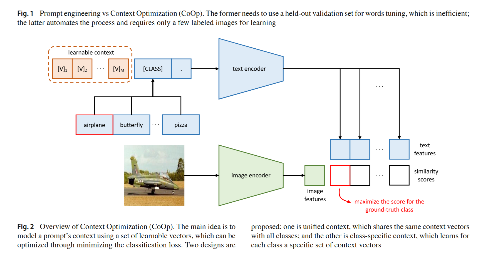
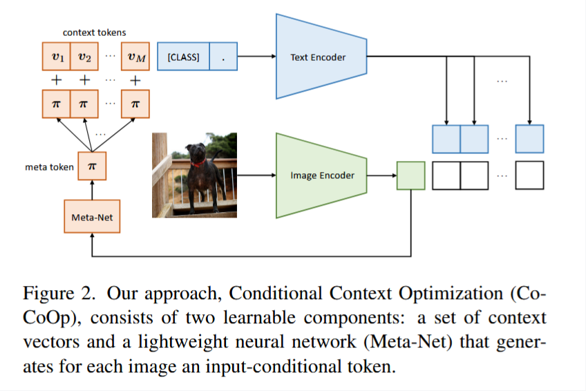
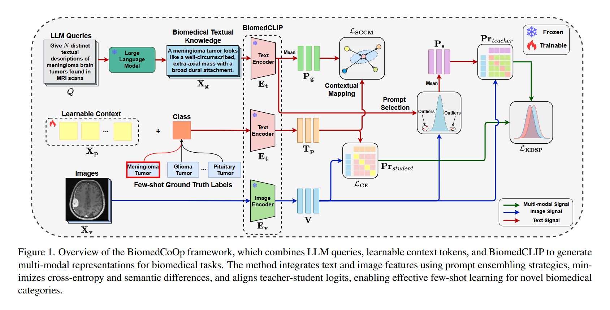

# paper-list
## FL  
### Communication-Efficient Learning of Deep Networks from Decentralized Data  
AISTATS 2017  
summary: FedAvg提出了经典的联邦平均算法，在保护用户本地数据不出设备的前提下，通过服务器协调多个客户端进行分布式模型训练。具体而言，各客户端基于本地数据对全局模型进行多轮梯度更新，服务器再按照客户端样本量对本地模型参数进行加权平均，得到新的全局模型。该方法显著减少了分布式训练中的通信轮次，为隐私保护场景下的高效协同学习奠定了基础，并成为后续联邦学习研究的核心基线方法。  

### FEDERATED TEXT-DRIVEN PROMPT GENERATION  FOR VISION-LANGUAGE MODELS  
code-link: https://github.com/boschresearch/FedTPG  
ICLR 2024  
summary：FedTPG（Federated Text-driven Prompt Generation） 方法，在联邦学习框架下设计一个 文本语义驱动的提示生成器（Text-driven Prompt Generator），利用类别的文本语义信息为视觉-语言模型自动生成可学习的提示向量，从而避免每个客户端独立学习提示导致的过拟合与数据异质性问题，并在不共享原始数据的情况下提升像 CLIP 这类视觉-语言模型在联邦环境中的泛化能力与稳定性。

### FedCLIP: Fast Generalization and Personalization for CLIP in  Federated Learning
code-link: https://github.com/microsoft/PersonalizedFL  
IEEE Data Engineering Bulletin 2023  
summary：FedCLIP方法通过为CLIP大模型设计基于注意力的轻量级适配器（AttAI），仅训练适配器参数而冻结预训练模型，通过分离视觉编码器与文本编码器的更新策略并引入对齐约束，在联邦学习中同时实现了快速泛化与个性化，并显著降低了计算和通信开销。   
  

### FedMVP: Federated Multimodal Visual Prompt Tuning for Vision-Language  Models
code-link: https://github.com/mainaksingha01/FedMVP    
ICCV 2025  
summary：FedMVP提出了一种联邦多模态视觉提示调优框架，通过PromptFormer模块利用交叉注意力机制协同对齐LLM生成的文本属性特征和视觉patch嵌入，在仅训练少量提示参数而冻结预训练CLIP模型的情况下，实现了联邦non-IID场景下视觉-语言模型对未见类别和领域的高效泛化适应。
  

### FedVLM: Scalable Personalized Vision-Language Models through Federated Learning
code-link: None  
ECAI 2025  
summary：FedVLM 框架通过在联邦学习中设计个性化低秩适配方法 pLoRA（仅聚合B矩阵、保留A矩阵本地个性化），解决了视觉-语言模型（VLM）在去中心化、非IID数据环境下难以高效个性化微调且通信开销大的问题，实现了隐私保护、低通信成本与高性能个性化适配的统一。  

## VLM  
### Learning to Prompt for Vision-Language Models  
code-link: https://github.com/KaiyangZhou/CoOp  
IJCV 2022  
summary：CoOp提出了一种面向视觉-语言模型CLIP的提示学习方法，通过将文本prompt中的上下文词表示为可学习向量，在冻结预训练模型参数的前提下仅更新少量prompt参数，实现对下游图像分类任务的高效适配。该方法包含统一上下文和类别特定上下文两种形式，在少样本设置下相比人工设计prompt取得了更优性能，同时具备较好的参数效率与迁移能力。 
  

### Conditional Prompt Learning for Vision-Language Models
code-link: https://github.com/KaiyangZhou/CoOp
CVPR 2022
summary: CoCoOp针对CoOp在少样本学习中容易过拟合基类、对新类别泛化能力不足的问题，提出一种条件式提示学习方法，在共享可学习上下文的基础上，通过轻量级元网络根据输入图像特征动态生成实例相关的prompt token，使文本提示能够随样本自适应调整。该方法在保持参数高效的同时有效提升了CLIP在base-to-novel泛化场景下的表现，相比静态prompt学习方法具有更好的跨类别泛化能力。  
   

### KgCoOp: Knowledge-guided Prompt Learning for Vision-Language Models  
code-link: https://github.com/htyao89/KgCoOp  
CVPR 2023  
summary: KgCoOp针对CoOp在少样本学习中容易过拟合基类、对新类泛化能力不足的问题，提出一种知识引导的提示学习方法，在学习可训练文本上下文的同时，引入预训练CLIP知识约束，保持学习后文本特征与原始手工prompt语义表示的一致性，从而在下游适配能力与跨类泛化能力之间取得更好平衡。该方法结构简单、参数高效，并在base-to-novel泛化设置下取得了优于CoOp的表现。  

### GalLoP: Learning Global and Local Prompts  for Vision-Language Models
code-link: https://github.com/MarcLafon/gallop  
ECCV 2024  
summary：GalLoP——Learning Global and Local Prompts for Vision-Language Models 提出一种同时学习 全局提示（global prompts）和局部提示（local prompts） 的提示学习方法，通过将文本提示分别与 整张图像的全局特征 和 图像中稀疏选择的局部区域特征 对齐，并利用 top-k稀疏区域选择、线性投影增强视觉-文本对齐、prompt dropout 以及多尺度局部提示策略 来提升提示多样性和判别能力，从而在少样本图像分类任务中同时提高 分类准确率、域泛化能力和OOD检测鲁棒性。

### BiomedCoOp: Learning to Prompt for Biomedical Vision-Language Models
code-link: https://github.com/HealthXLab/BiomedCoOp  
cvpr 2025  
summary：这篇论文针对 通用视觉-语言模型（如CLIP）在生物医学图像任务中适配困难、提示词依赖人工设计且医学数据标注稀缺的问题，提出了一种面向医学领域的 Prompt Learning 方法 BiomedCoOp，用于在少样本条件下有效提升 biomedical VLM 的分类性能。具体而言，作者以 BiomedCLIP 为基础，引入两项关键机制来学习更符合医学语义的提示表示：首先提出 Semantic Consistency by Contextual Mapping (SCCM)，利用 LLM 自动生成的类别级医学描述 prompt 作为先验知识，通过最小化可学习上下文向量与这些医学语义提示之间的距离，使模型学习到更符合医学语义空间的文本表示，从而缓解传统 CoOp 在专业领域语义不足的问题；其次设计 Knowledge Distillation with Selective Prompting (KDSP)，通过统计信息对候选 prompt 进行筛选，并将其知识蒸馏到可学习的上下文表示中，从而提升 prompt 的稳定性和泛化能力。最终，BiomedCoOp 通过联合优化分类损失与语义对齐目标，实现了在 少样本医学图像分类任务中对 biomedical VLM 的高效适配，在多个医学数据集上显著优于传统 prompt learning 和线性探测方法。
  
