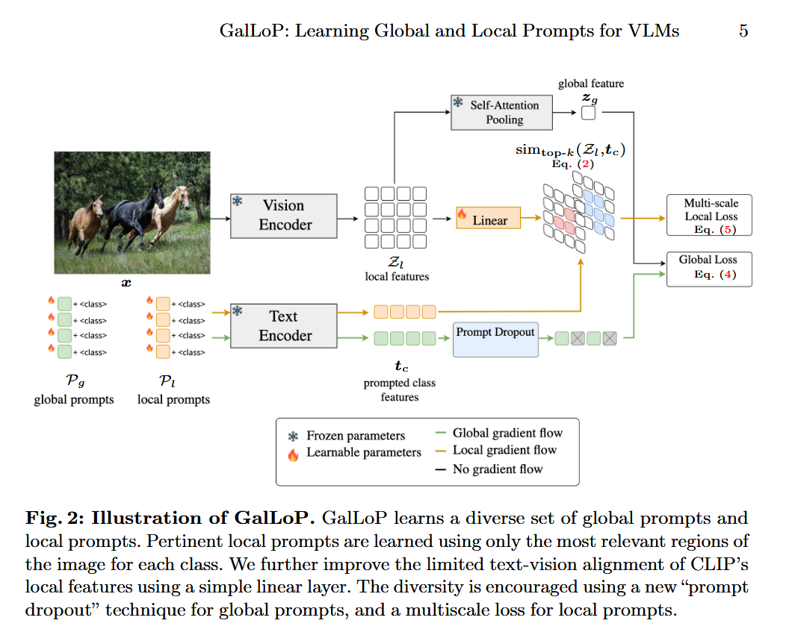
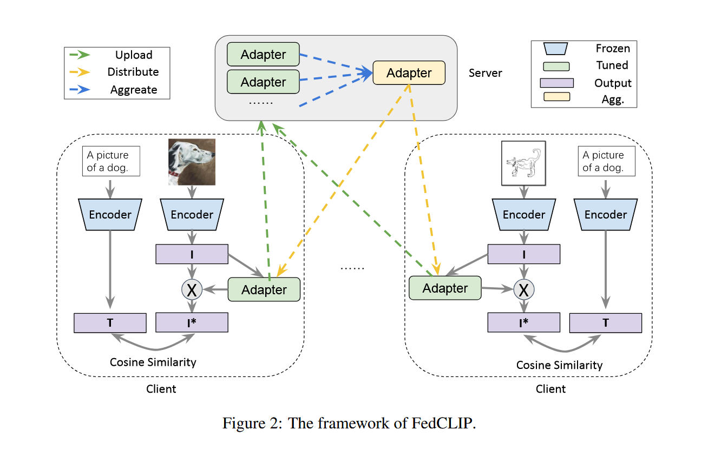
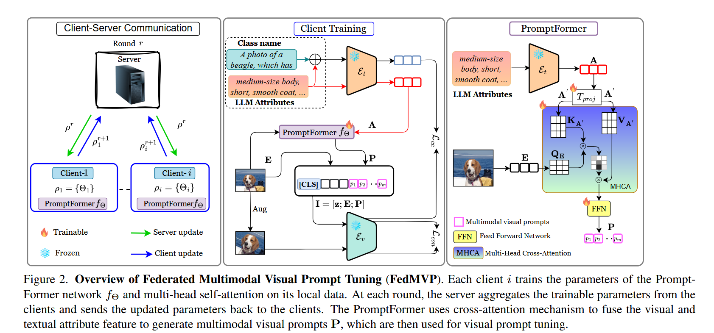

# paper-list
## VLM
### GalLoP: Learning Global and Local Prompts  for Vision-Language Models
code-link: https://github.com/MarcLafon/gallop  
ECCV 2024  
summary：GalLoP 通过稀疏选择 + 特征对齐学习强判别力的局部提示，并借助prompt dropout + 多尺度策略增强全局/局部提示的多样性，从而在保持高分类准确率的同时显著提升模型鲁棒性，打破了准确率与鲁棒性的传统权衡。

## FL
### FEDERATED TEXT-DRIVEN PROMPT GENERATION  FOR VISION-LANGUAGE MODELS  
code-link: https://github.com/microsoft/PersonalizedFL  
IEEE Data Engineering Bulletin 2023  
summary：FedCLIP方法通过为CLIP大模型设计基于注意力的轻量级适配器（AttAI），仅训练适配器参数而冻结预训练模型，通过分离视觉编码器与文本编码器的更新策略并引入对齐约束，在联邦学习中同时实现了快速泛化与个性化，并显著降低了计算和通信开销。   
  
### FedCLIP: Fast Generalization and Personalization for CLIP in  Federated Learning
code-link: https://github.com/microsoft/PersonalizedFL  
IEEE Data Engineering Bulletin 2023  
summary：FedCLIP方法通过为CLIP大模型设计基于注意力的轻量级适配器（AttAI），仅训练适配器参数而冻结预训练模型，通过分离视觉编码器与文本编码器的更新策略并引入对齐约束，在联邦学习中同时实现了快速泛化与个性化，并显著降低了计算和通信开销。   
  

### FedMVP: Federated Multimodal Visual Prompt Tuning for Vision-Language  Models
code-link: https://github.com/mainaksingha01/FedMVP    
ICCV 2025  
summary：FedMVP提出了一种联邦多模态视觉提示调优框架，通过PromptFormer模块利用交叉注意力机制协同对齐LLM生成的文本属性特征和视觉patch嵌入，在仅训练少量提示参数而冻结预训练CLIP模型的情况下，实现了联邦non-IID场景下视觉-语言模型对未见类别和领域的高效泛化适应。
  

### FedVLM: Scalable Personalized Vision-Language Models through Federated Learning
code-link: None  
ECAI 2025  
summary：FedVLM 框架通过在联邦学习中设计个性化低秩适配方法 pLoRA（仅聚合B矩阵、保留A矩阵本地个性化），解决了视觉-语言模型（VLM）在去中心化、非IID数据环境下难以高效个性化微调且通信开销大的问题，实现了隐私保护、低通信成本与高性能个性化适配的统一。  
